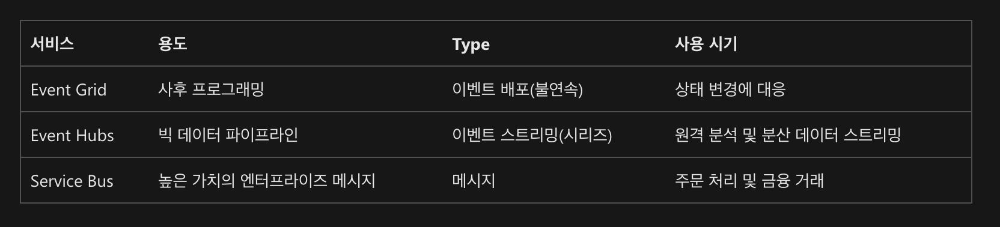

### 💯 Question 6-15

6. azure blob storage metadata update?
- 🔔 metadata.Add("docType", "textDocuments");
- await blob.SetMetadataAsync(metadata);
- await blob.SetPropertiesAsync();

7. 매일 2MB 장치 데이터를 수집하는 솔루션. 각 스토어에는 1~5개의 장치가 있고 이 데이터는 블롭 저장소에 저장됨. 향후 추가 매장 오픈 예정.
- 🔔 Event Grid does not have a capture feature and it does not store data in Blob storage. You need to use Event Hubs as your source and enable capture with Blob storage as your destination.

8. 닷넷 앱이 vm이 데이터 처리를 끝낼 때마다 메시지를 받고자 한다. 수신 앱에서 처리된 후에 메시지는 지속되지 않는다.

9. 블롭 스토리지 프리미엄 티어 사용. 3개월된 데이터 거의 사용 안함. 그러나 즉시 사용할 수 있어야함. 1년이 지난건 즉시 사용하지 못해도 됨.
- 🔔 일단 v2로 업그레이드(핫,쿨,아카이브 나눌 수 있음.) -> 아카이브될 데이터들 복사해서 아카이브 폴더에 복사하고 여기선 삭제 -> 쿨로 변경

10. 분산 데베에 연결하려면? 
- 🔔 this.cosmosClient = new CosmosClient(EndpointUri, PrimaryKey)

11. 여러 컨테이너로 부터 대량 데이터를 저장하는 스토리지 계정. 새 스토리지로 복사해야함. 자동화된 이동, 사용자 입력 최소화?
- 🔔 AzCopy v10 명령줄 유틸리티를 사용하여 스토리지 계정 간에 BLOB, 디렉토리 및 컨테이너를 복사할 수 있음.

12. 관리id 사용하는 애저 스토리지 계정 이용하는 웹서비스 개발. secret인증 기반은 허용하지 않음. 애저 인스턴스 메타데이터 서비스 엔드포인트만 이용. 액세스 토큰 검색하는 코드 작성.
- 🔔 url: 169.254.169.254/metadata/identity/oauth2/token
- DeserializeObject<Dictionary<string, string>>(payload)

13. cosmosDB select문 소팅시 ?
- 🔔 compositeIndexes -> desceding

14. 6개 고속도로 교통 감사 시스템 구축, 4개 부서에서 사용. 각 부서는 애저 웹앱을 사용하며, 모든 웹앱은 세 개의 인스턴스와 플랜으로 구축됨. 데이터 처리량 최대화 지연시간 최대화하는 이벤트 허브?
> 🔖 better to know     
이벤트 그리드와 허브 그리고 서비스 버스 비교

- 🔔 number of partition? 6
- partition key? highway

15. MSA 개발, 다중 노드 aks 클러스터에 배포.
> - reverse proxy capabilities   
> - configurable traffic routing   
> - TLS termination with a custom certificate  
- 🔔 deployee solution ? ****helm(k8s 패키지매니저)**
- view cluster and external ip addressing?  **k8s**
- implement single public ip endpoint that is routed to multiple msa? **ingress controller**